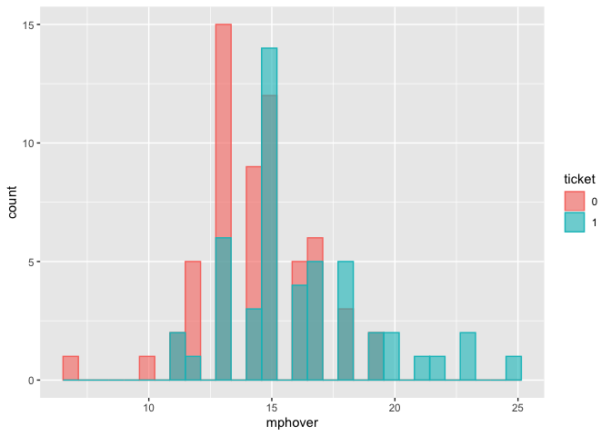

Stats 1: An Introduction
================
Sara Stoudt (@sastoudt)
3/8/2020

## Loading packages

Find out more about the tidyverse [here](https://www.tidyverse.org/).

``` r
#install.packages("tidyverse")
library(tidyverse)
```

## Loading data

Using data from [previous version of this
course](https://ireapps.github.io/nicar-2020-schedule#20200306_stats_1_an_introduction_1094_all)

``` r
boston <- read_csv("boston.csv")
```

Other ways to [load data](https://readr.tidyverse.org/):

  - [Excel spread sheets](https://readxl.tidyverse.org/)
  - [Google
    sheets](https://cran.r-project.org/web/packages/googlesheets/googlesheets.pdf)
  - Fixed width: `read_fwf()`
  - Delimited files:
    `read_delim()`

## Look at data

``` r
names(boston)
```

    ##  [1] "X1"       "VAR001"   "type"     "citation" "agency"   "race"    
    ##  [7] "sex"      "daynight" "day"      "descript" "mph"      "zone"    
    ## [13] "mphover"  "mphpct"   "age"      "ticket"   "minority" "female"

``` r
dim(boston)
```

    ## [1] 110  18

``` r
head(boston)
```

    ## # A tibble: 6 x 18
    ##      X1 VAR001 type  citation agency race  sex   daynight   day descript   mph
    ##   <dbl> <lgl>  <chr> <chr>    <chr>  <chr> <chr> <chr>    <dbl> <chr>    <dbl>
    ## 1     1 NA     W     K0159501 Boyls… W     M     day          1 SPEEDING    52
    ## 2     2 NA     W     K0159502 Boyls… W     M     day          1 SPEEDING    47
    ## 3     3 NA     W     K0159503 Boyls… W     F     day          1 SPEEDING    49
    ## 4     4 NA     T     K0159504 Boyls… W     M     day          1 SPEEDING    54
    ## 5     5 NA     W     K0159505 Boyls… W     M     day          1 SPEEDING    57
    ## 6     6 NA     W     K0159506 Boyls… W     F     day          1 SPEEDING    62
    ## # … with 7 more variables: zone <dbl>, mphover <dbl>, mphpct <dbl>, age <dbl>,
    ## #   ticket <dbl>, minority <dbl>, female <dbl>

``` r
str(boston)
```

    ## tibble [110 × 18] (S3: spec_tbl_df/tbl_df/tbl/data.frame)
    ##  $ X1      : num [1:110] 1 2 3 4 5 6 7 8 9 10 ...
    ##  $ VAR001  : logi [1:110] NA NA NA NA NA NA ...
    ##  $ type    : chr [1:110] "W" "W" "W" "T" ...
    ##  $ citation: chr [1:110] "K0159501" "K0159502" "K0159503" "K0159504" ...
    ##  $ agency  : chr [1:110] "Boylston" "Boylston" "Boylston" "Boylston" ...
    ##  $ race    : chr [1:110] "W" "W" "W" "W" ...
    ##  $ sex     : chr [1:110] "M" "M" "F" "M" ...
    ##  $ daynight: chr [1:110] "day" "day" "day" "day" ...
    ##  $ day     : num [1:110] 1 1 1 1 1 1 1 1 1 1 ...
    ##  $ descript: chr [1:110] "SPEEDING" "SPEEDING" "SPEEDING" "SPEEDING" ...
    ##  $ mph     : num [1:110] 52 47 49 54 57 62 53 54 57 62 ...
    ##  $ zone    : num [1:110] 35 35 35 40 45 45 35 35 45 45 ...
    ##  $ mphover : num [1:110] 17 12 14 14 12 17 18 19 12 17 ...
    ##  $ mphpct  : num [1:110] 49 34 40 35 27 38 51 54 27 38 ...
    ##  $ age     : num [1:110] 26 41 50 32 48 30 30 41 60 45 ...
    ##  $ ticket  : num [1:110] 0 0 0 1 0 0 0 0 0 0 ...
    ##  $ minority: num [1:110] 0 0 0 0 0 0 0 0 0 0 ...
    ##  $ female  : num [1:110] 0 0 1 0 0 1 0 0 1 1 ...
    ##  - attr(*, "spec")=
    ##   .. cols(
    ##   ..   X1 = col_double(),
    ##   ..   VAR001 = col_logical(),
    ##   ..   type = col_character(),
    ##   ..   citation = col_character(),
    ##   ..   agency = col_character(),
    ##   ..   race = col_character(),
    ##   ..   sex = col_character(),
    ##   ..   daynight = col_character(),
    ##   ..   day = col_double(),
    ##   ..   descript = col_character(),
    ##   ..   mph = col_double(),
    ##   ..   zone = col_double(),
    ##   ..   mphover = col_double(),
    ##   ..   mphpct = col_double(),
    ##   ..   age = col_double(),
    ##   ..   ticket = col_double(),
    ##   ..   minority = col_double(),
    ##   ..   female = col_double()
    ##   .. )

``` r
#View(boston) ## this is a comment
```

## Summaries of Continuous Variables

``` r
## continuous
boston %>% select(mph) %>% summary()
```

    ##       mph       
    ##  Min.   :42.00  
    ##  1st Qu.:50.00  
    ##  Median :54.00  
    ##  Mean   :54.63  
    ##  3rd Qu.:58.00  
    ##  Max.   :68.00

``` r
boston %>% select(mphover) %>% summary()
```

    ##     mphover     
    ##  Min.   : 7.00  
    ##  1st Qu.:13.00  
    ##  Median :15.00  
    ##  Mean   :15.17  
    ##  3rd Qu.:17.00  
    ##  Max.   :25.00

## Summaries of Discrete Variables

``` r
## discrete
boston %>% select(sex) %>% table()
```

    ## .
    ##  F  M  U 
    ## 46 63  1

``` r
boston %>% select(race) %>% table()
```

    ## .
    ##  A  B  H  M  U  W 
    ##  2  6  9  1  1 91

``` r
boston %>% select(daynight) %>% table()
```

    ## .
    ##   day night 
    ##    53    57

``` r
boston %>% select(ticket) %>% table()
```

    ## .
    ##  0  1 
    ## 61 49

## Two-Way Summaries

``` r
## two-table
boston %>% select(sex, race) %>% table()
```

    ##    race
    ## sex  A  B  H  M  U  W
    ##   F  0  2  4  1  0 39
    ##   M  2  4  5  0  0 52
    ##   U  0  0  0  0  1  0

``` r
boston %>% select(sex, ticket) %>% table()
```

    ##    ticket
    ## sex  0  1
    ##   F 30 16
    ##   M 30 33
    ##   U  1  0

``` r
boston %>% select(race, ticket) %>% table() 
```

    ##     ticket
    ## race  0  1
    ##    A  0  2
    ##    B  1  5
    ##    H  2  7
    ##    M  0  1
    ##    U  1  0
    ##    W 57 34

## Summaries by Group

Find out more about summaries [here](https://dplyr.tidyverse.org/).

``` r
boston %>%
  group_by(sex) %>%
  summarise(meanSpeeding = mean(mphover))
```

    ## # A tibble: 3 x 2
    ##   sex   meanSpeeding
    ##   <chr>        <dbl>
    ## 1 F             15  
    ## 2 M             15.3
    ## 3 U             13

``` r
boston %>%
  group_by(daynight) %>%
  summarise(meanSpeeding = mean(mphover))
```

    ## # A tibble: 2 x 2
    ##   daynight meanSpeeding
    ##   <chr>           <dbl>
    ## 1 day              15.2
    ## 2 night            15.1

``` r
boston %>%
  group_by(ticket) %>%
  summarise(meanSpeeding = mean(mphover), minSpeeding = min(mphover), maxSpeeding = max(mphover))
```

    ## # A tibble: 2 x 4
    ##   ticket meanSpeeding minSpeeding maxSpeeding
    ##    <dbl>        <dbl>       <dbl>       <dbl>
    ## 1      0         14.3           7          19
    ## 2      1         16.2          11          25

``` r
## two way
boston %>% group_by(ticket, zone) %>% summarise(count = n()) %>% arrange(zone)
```

    ## # A tibble: 7 x 3
    ## # Groups:   ticket [2]
    ##   ticket  zone count
    ##    <dbl> <dbl> <int>
    ## 1      0    35    25
    ## 2      1    35    28
    ## 3      0    40    10
    ## 4      1    40     7
    ## 5      0    45    25
    ## 6      1    45    14
    ## 7      0    50     1

## Transforming Variables

**[Factors](https://forcats.tidyverse.org/)**

``` r
## make ticket factor
class(boston$ticket)
```

    ## [1] "numeric"

``` r
boston$ticket <- as.factor(boston$ticket)
class(boston$ticket)
```

    ## [1] "factor"

``` r
## group race --> minority

boston <- boston %>% mutate(minority = case_when(
  race == "W" ~ 0,
  race != "W" ~ 1
))

boston %>% select(minority) %>% table()
```

    ## .
    ##  0  1 
    ## 91 19

``` r
## recode sex --> female

boston <- boston %>% mutate(female = case_when(
  sex == "F" ~ 1,
  sex == "M" ~ 0
)) ## U will become NA

boston %>% select(female) %>% table()
```

    ## .
    ##  0  1 
    ## 63 46

``` r
boston <- boston %>% mutate(mphover = mph - zone)

boston %>% select(mphover) %>% summary()
```

    ##     mphover     
    ##  Min.   : 7.00  
    ##  1st Qu.:13.00  
    ##  Median :15.00  
    ##  Mean   :15.17  
    ##  3rd Qu.:17.00  
    ##  Max.   :25.00

## [Plots](https://ggplot2.tidyverse.org/)

``` r
ggplot(boston, aes(x = mphover)) +
  geom_histogram(position = "identity")
```

<!-- -->

``` r
## mph over by ticket
ggplot(boston, aes(x = mphover, color = ticket, fill = ticket)) +
  geom_histogram(alpha = 0.6, position = "identity")
```

<!-- -->

``` r
## three variables
ggplot(boston, aes(x = mphover, color = ticket, fill = ticket)) +
  geom_histogram(alpha = 0.6, position = "identity") + facet_wrap(~female)
```

<!-- -->

## Statistical Tests

**Is the average miles per hour over the speed limit different for
ticket and non-tickets?**

*difference in means test*

``` r
t.test(mphover ~ ticket, data = boston)
```

    ## 
    ##  Welch Two Sample t-test
    ## 
    ## data:  mphover by ticket
    ## t = -3.6123, df = 84.403, p-value = 0.0005145
    ## alternative hypothesis: true difference in means is not equal to 0
    ## 95 percent confidence interval:
    ##  -2.940664 -0.852578
    ## sample estimates:
    ## mean in group 0 mean in group 1 
    ##        14.32787        16.22449

*Assumptions*

  - large sample size (at least \>30)
  - independent samples (independence between drivers)

*Null hypothesis:* There is no significant difference in the average
miles per hour over the speed limit for tickets and non-tickets.

*Alternative hypothesis:* There is a significant difference in the
average miles per hour over the speed limit for tickets and non-tickets.

*Interpretation:* If the average miles per hour over the speed limit was
the same for tickets and non-tickets, we would get a difference in means
equal to or more extreme to the one we see here with probablility 0.0005
(p-value). This is unlikely, providing evidence for the hypothesis that
there is a difference.

*Healthy skepticism*: Is the difference practically significant?

**Is the proportion of females getting tickets different than the
proportion of males getting tickets?**

*difference in proportions test*

``` r
prop.test(table(boston$ticket, boston$female)) 
```

    ## 
    ##  2-sample test for equality of proportions with continuity correction
    ## 
    ## data:  table(boston$ticket, boston$female)
    ## X-squared = 2.6543, df = 1, p-value = 0.1033
    ## alternative hypothesis: two.sided
    ## 95 percent confidence interval:
    ##  -0.3743424  0.0274036
    ## sample estimates:
    ##    prop 1    prop 2 
    ## 0.5000000 0.6734694

*Assumptions*

  - observations are random sample of population
  - independent observations
  - have at least 10 successes (ticket) and 10 failures (no ticket)

*Null hypothesis:* There is no significant difference in proportion of
males and females who got tickets.

*Alternative hypothesis:* There is a significant difference in
proportion of males and females who got tickets.

*Interpretation:* If the proportion of males and females who got tickets
were the same, we would get a difference in proportions equal to or more
extreme to the one we see here with probablility 0.068 (p-value). This
is bigger than a typical cutoff used (0.05), providing less evidence for
the hypothesis that there is a difference.

*Healthy skepticism*: What if females were more likely to drive during
the day and tickets are more likely to be given out at night? Also what
is so magical about the 0.05 p-value cut-off?

To deal with this kind of thing stick around for [Linear
Regression](https://ireapps.github.io/nicar-2020-schedule#20200308_stats_2_linear_regression_repeat_1098_all).
